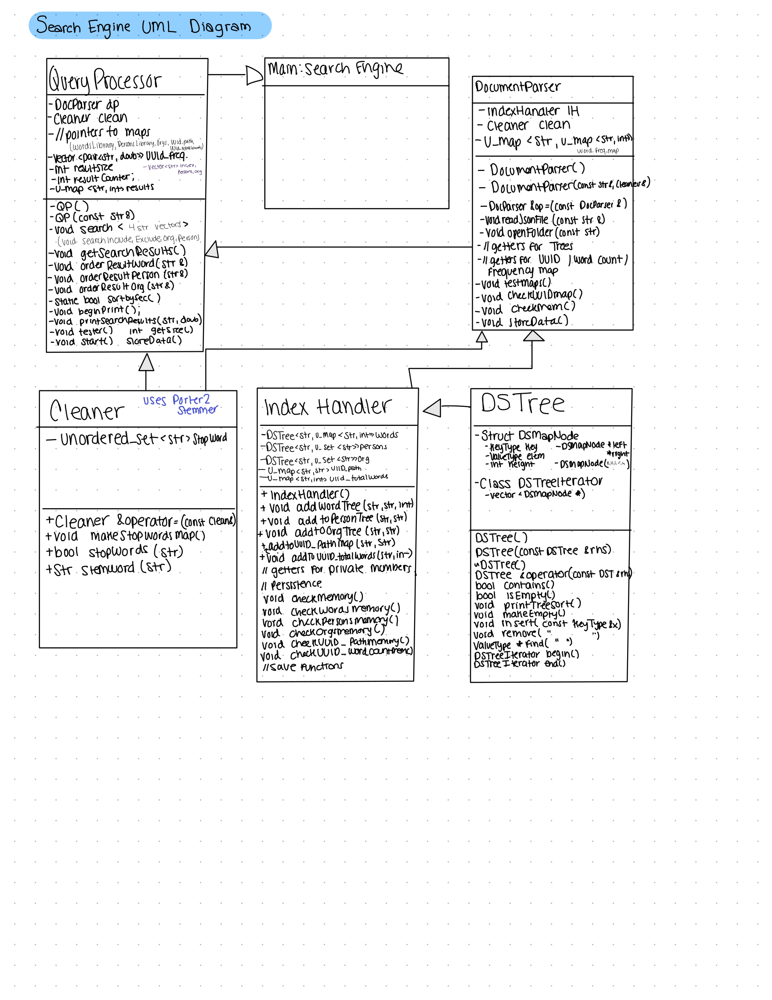
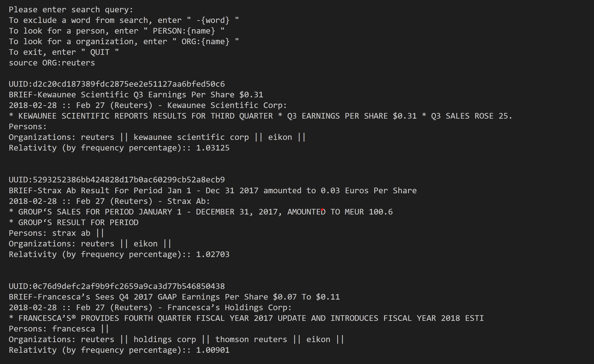
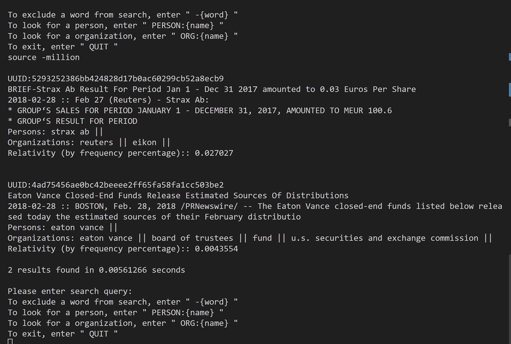
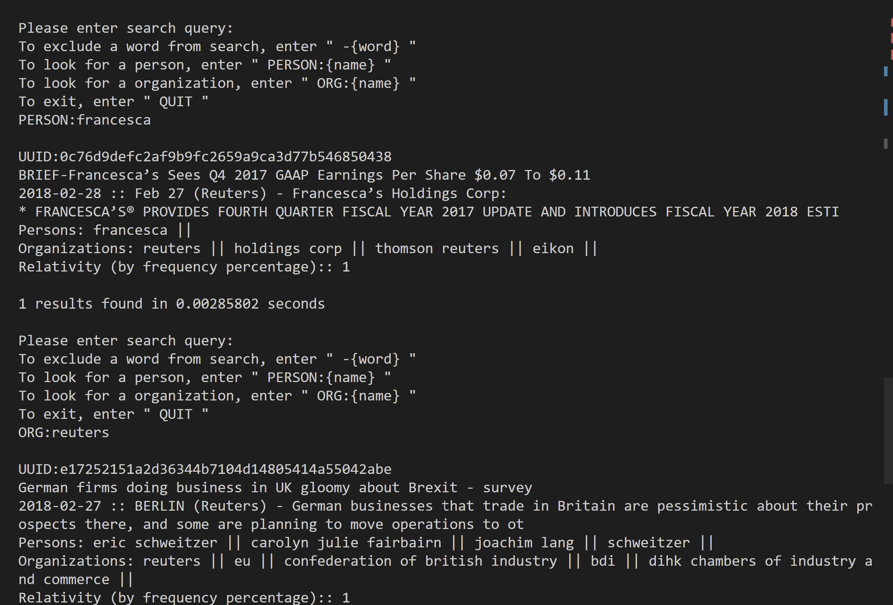
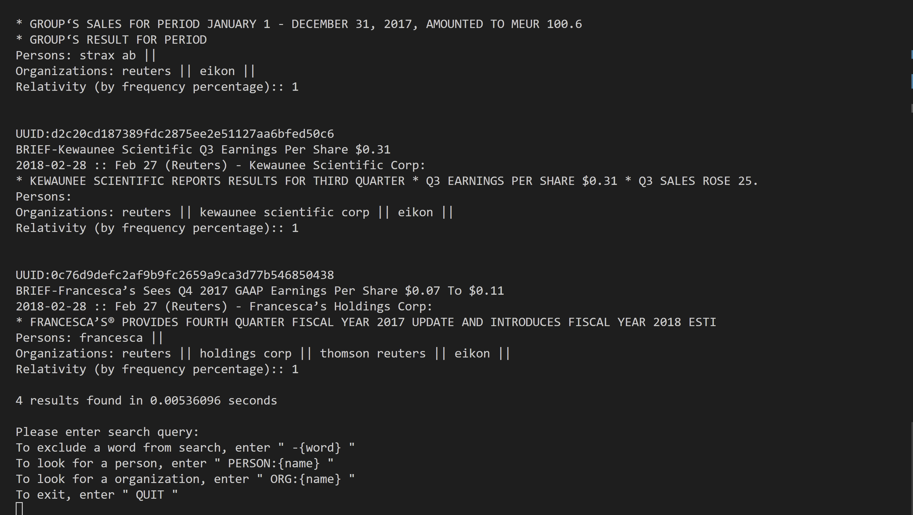

# Submission 

In addition to the code, you need to submit a markdown document called `documentation.md` containing the following information (You can copy and paste the section structure below):

## High-level Design of Solution

### UML class diagram

### High-level pseudo code for each component.

**Cleaner:** 
  Cleaner makes an unordered_set of stopwords from stopwords.csv in the constructor. Then in both the DocParser and QueryProcessor, we call the Cleaner functions stopwords and stemword, respectively. Stopwords returns true when the passed in word matches a stopword in the stopwords. Stemword stems the word to make searching more precise. 

**QueryProcessor:** 
  Takes in user input and parses it into a vector, then from there, we pass the input into the correct search vectors based on what type it is (include, person, exclude, org), and search the correct tree for each. Then we check which documents include all of the entries we are searching for, and we put those into a results map. From that map, we put the uuid’s that we want to return in a vector in order from highest frequency to lowest. After that, we simply use the uuid to find the path of the we want and print out what the user would see in the terminal. 

**DocumentParser:** 
  Our document parser makes the three trees for words, persons, and organizations, as well as two maps for uuid and total words in that doc and uuid and path to the file. This is what we use in the query processor to find all the results we need. 

**IndexHandler:** 
  IndexHandler is our center of the project. Although not a lot of high level functions are done in here, it stores the trees and maps in here, and their getters and setters to return the maps and trees using the memory address and pointers in the DocParser and QueryProcessor. 

**DSTree:** 
  AVL tree implementation. Used to store words, persons, and organizations in the key as strings, and the comparables being unordered_maps or unordered_sets for storing the uuids. 

## Your Timeline to Finish the Project
Weekly milestones/tasks. Set out a plan at the beginning and then record when you got it done.

| Task                | Planned Completion | Actual Completion | Hours by Arath | Hours by Marcos |
|---------------------|-------------------|-------------------|----------------|-----------------|
| DSTree              | Apr 4             | Apr 6             | 5              | 2               |
| IndexHandler + Cleaner | Apr 11            | Apr 13            | 4              | 4               |
| QueryProcessor      | Apr 16            | Apr 16            | 4              | 8               |
| DocumentParser      | Apr 20            | Apr 21            | 5              | 8               |
| Documentation.md    | Apr 25            | Apr 28            | 4              | 4               |

## Used Data Structures

Explanation of what data structures are used where. For each, state 

- time and space complexity (Big-Oh),
- why it is the appropriate data structure and what other data structure could have been used.

**Cleaner:** 
- Unordered_set<string> stopwordsLibrary – used to store stopwords and search for stopwords extremely quickly 
  - Space Complexity: O(N) 
  - Time Complexity: O(1) 

**QueryProcessor:** 
- Vector<pair<string,double>> uuids_frequencies: used to store the uuid and frequency score for each uuid we are returningin order. 
  - Space Complexity: O(N) 
  - Time Complexity: O(N) 

- unordered_map<string, int> results: used to store all the uuids that include the word, person or org, and the int is incremented when we find a match. The int for each should match resultsSize. 
  - Space Complexity: O(N) 
  - Time Complexity: O(1) 

These used to store the words we will be searching: 
- Vector<string> includes:  
  - Space Complexity: O(N) 
  - Time Complexity: O(N) 

- Vector<string> excludes:  
  - Space Complexity: O(N) 
  - Time Complexity: O(N) 

- Vector<string> persons: 
  - Space Complexity: O(N) 
  - Time Complexity: O(N) 

- Vector<string> orgs:  
  - Space Complexity: O(N) 
  - Time Complexity: O(N) 

Pointers to all DSTrees and unordered_maps from docParser 

**DocumentParser:** 
- Unordered_map<string , unordered_map<string,int>>> : Used as a temp container for the word, and all the uuids and frequencies of that word that I would add to the DSTree for words by looping through it after finishing with document parsing for a single document. 
  - Space Complexity: O(N) 
  - Time Complexity: O(1) 

**IndexHandler:**
- DSTree<string, unordered_map<string,int>> words: Used to store the word and an unorderd_map that stores uuids of all the docs it appears in along with the amount of times it appears in the text. 
  - Space Complexity: O(N) 
  - Time Complexity: O(logN) 

- DSTree<string , unordered_set<string> persons/organizations: Used to store person or organization in their trees, along with a unordered_set of the uuid’s of the docs they appear in. 
  - Space Complexity: O(N) 
  - Time Complexity: O(logN) 

- Unordered_map<string , string> UUID_PATH: Used to store the uuid with the path to the document, allowing for quick lookup when trying to print out results. 
  - Space Complexity: O(N) 
  - Time Complexity: O(1) 

- Unordered_map <string , int> uuid_totalWords: used to store the document’s uuid with number of total words in that document, used for relevancy in query processor. 
  - Space Complexity: O(N) 
  - Time Complexity: O(1) 

## User Documentation
- How to use the software.

Welcome to our Search Engine! 

The search engine is ran with the executable **supersearch** that takes in a command line argument as the filepath name to a folder with several JSON news articles. This will populate a library of document names that are attributed to certain words, organizations, and persons; as well as words to exclude. 

To build the search engine, navigate to the repository using and copy and paste the following lines of code into your terminal

      cd <your repository>
      cmake . -B build -DCMAKE_BUILD_TYPE=Release
      cd build
      make supersearch
      ./supersearch <dataFilePath>

Once the last line of code is run, the welcome message will appear and give user the opportunity to enter a search query. Ensure that the search query is **lowercase**. The search engine will continue to allow user input until user inputs 'QUIT'.

Persistence is stored in the build folder under /build/Memory/

- Some example queries with the results. (using sample_data)

**Example Query: source ORG:reuters**

**Example Query: source -million**

**Example Query: PERSON:francesca**

**Example Query: ORG:reuters**

## Performance
| Number of Documents      | Time (s) | Documents/Sec | Search:              | Results Found | Time to Find Results |
| :-----------: | :-----------------: | :--------: | :-----------:            | :--------------:     | :--------------: |
| 57808         |          23.7074    |  2438.39   | source PERSON: francesca |     2                | 1.00216      |
| 325           |          0.0991891  |  3276.57   | source                   |     113              | 0.00229021   |
| 149           |  0.0471527          |  3159.95   |  source -million         |     22               |  0.00169417  |
|  6            | 0.00287042          |   2090.29  | source -million          |     2                |  0.000686916 |

## Automatic Tests and Memory Tests
You need to describe test cases for:
- Tests for your AVL tree's function

**test_DSTree.cpp** tests 9 assertions for the functions in DSTree. The first section of the test case checks the insert() function of the DSTree. It creates an empty DSTree object, inserts two integers 5 and 10, and then checks if the tree contains these values using the contains() function. It also checks that the contains() function returns false when it is called with a value that has not been inserted into the tree. 

The second section tests the remove() function of the DSTree. It creates a DSTree object, inserts two integers 5 and 10, removes the value 5 using the remove() function, and then checks that the value 5 is no longer in the tree. It also checks that the value 10 is still in the tree after removing 5, and then removes the value 10 and checks that it is no longer in the tree.

The third section tests the copy constructor and assignment operator of the DSTree. It creates a DSTree object, inserts two integers 5 and 10, and then creates another DSTree object called tree2 using the copy constructor. It checks that both tree and tree2 contain the values 5 and 10. It also creates a new DSTree object of strings called words and inserts two strings "tacos" and "good". It checks that the find() function returns the value "tacos" when it is called with the string "tacos".

Additionally, we ran the DSTree tests on valgrind, allowing us to check for memory leaks stemming from the DSTree. There was no memory leaks, and to confirm this, we checked if the Memory/* files (our implementation of persistence) were correctly populated in the build folder. We compared this with our output using test maps to check if everything that was supposed to be present was there.

- Tests for indexer and document parser

**test_DocParser.cpp**
For the indexer, we tested it while testing our DocumentParser (as they were pretty integrated). We used the testMaps() function and compared it to the files that we stored in Memory to make sure they matched up. 
"Read JSON file" section: This section tests the ability of the DocumentParser class to read an existing JSON file and correctly extract entities (persons, organizations) and store them in respective data structures. It also checks that id_path and uuid_totalWords maps are populated correctly.

"READ BAD JSON" section: This section tests the error handling mechanism of the DocumentParser class when a non-existing JSON file is provided as input. It checks that all data structures remain empty.

"Open folder" section: This section tests the ability of the DocumentParser class to open a folder containing multiple JSON files and extract entities from each file. It checks that all data structures are populated correctly.

"Get word frequencies" section: This section tests the ability of the DocumentParser class to calculate the frequency of a given word in a collection of documents. It tests the functionality for both existing and non-existing words in the documents.

- Tests for performing queries

**test_QP.cpp**
The first section tests that a QueryProcessor object can be created with a folder of data, and that a search can be run on the data using the "source" term, resulting in a size of 4.
The second section tests that a search on the same data using the "million" term with the exclude option results in a size of 2.
The third section tests that a search on the same data using both the "source" and "million" terms with the include option results in a size of 2.
The fourth section tests that a search on the same data using the "francesca" term in the persons field results in a size of 1.
The fifth section tests that a search on the same data using the "reuters" term in the orgs field results in a size of 4.

**Hint:** For testing you should use a very small dataset (e.g., set of documents) where you know what the correct output is 
  and then a larger set to check that your data structures can handle more data.

## Bonus Work (max. of 10)

* During the presentation, we will test your implementation to determine the following. 
    1. The indexing and query speed on a smaller dataset.
    2. The correctness of the result for several queries on that dataset.
  For all teams with correct results, the top 10% of teams according to indexing and query speed will be awarded a bonus of +10. The next 10% will be awarded +5. Note that speed depends all on using the most appropriate and optimized data structures.
* To speed up query processing, you can implement your own hash map from scratch for the organization and person 
  index. (up to +5)
* Analytics for the corpus (e.g., report current indexing speed in documents/second, update the speed every 100 
  documents; 10 most popular terms, 10 least popular terms, number of terms in the index, ...) (up to +2)
* Implementation of very smart relevancy ranking ideas (up to +2)
 

## Grading Rubric

| Task                        | Points Possible | Points Awarded |
| :------------------         | --------------: | -------------: |
| UML diagram/design          | 10              |                |
| AVL tree map + tests        | 20              |                |
| AVL tree persistence + tests| 10              |                |
| Document parser / indexer   | 10              |                |
| Query processor + interface | 20              |                |
| Proper Memory Management    | 5               |                |
| Formatting, Comments, etc.  | 5               |                |
| Documentation               | 20              |                |
| Bonus Work                  | up to +10       |                |
| 48hr early submission bonus | +5              |                |

